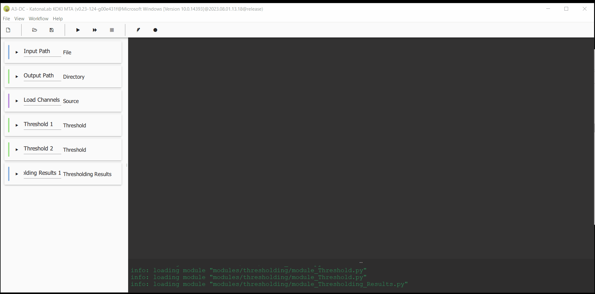
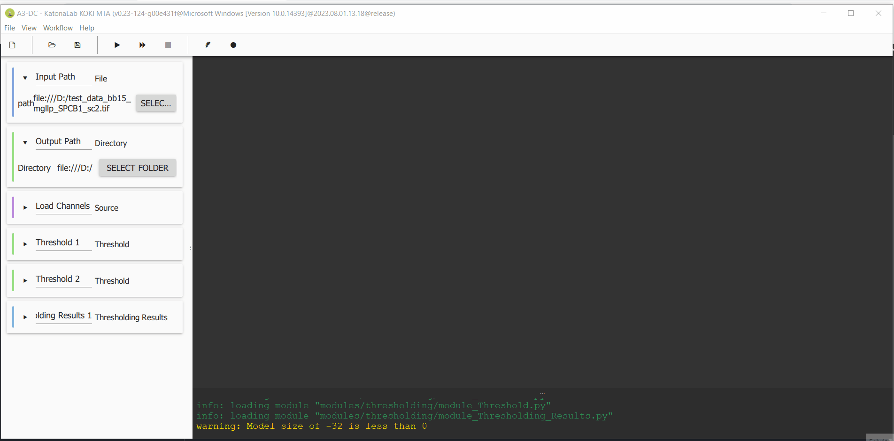
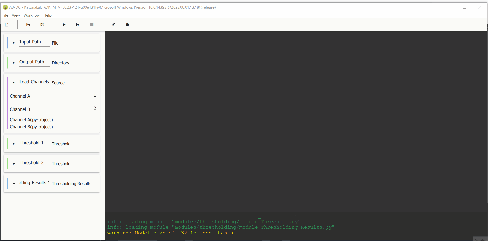
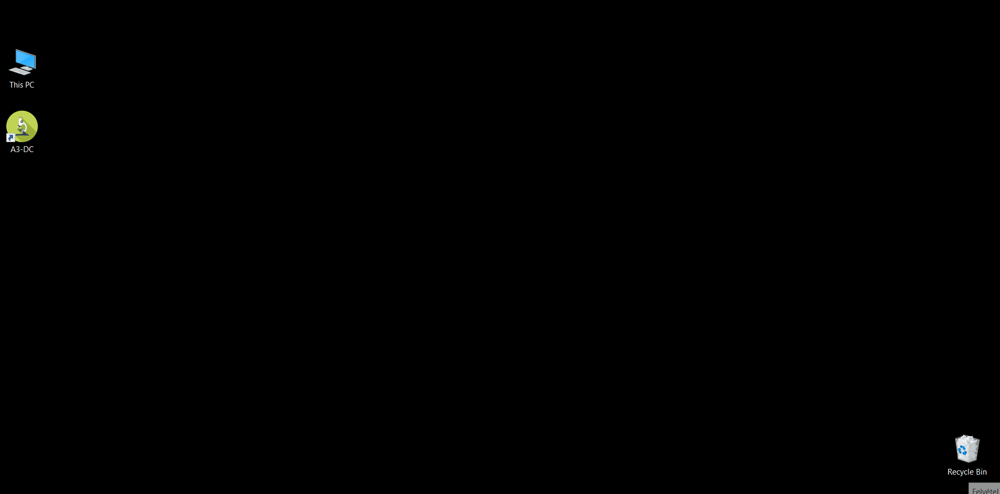

# <ins>A3-DC</ins>
A3-DC is a software to analyze object based colocalization in multichannel microscopy images. The goal of the software is to process large datasets, so processing can be run on individual images and or in batch.

Cite: 
 > ["Dijkstra, E. W. (1968). Go to statement considered harmful. Communications of the ACM, 11(3), 147-148."](https://dl.acm.org/doi/10.1016/S0164-1212%2801%2900136-4)

## <ins>Installation</ins>
First download the A3-DC install from the following link: 
[Download installer.](https://google.com) 

Run installer and follow the instructions below. Depending on the computer setup the installer might have to be run as **administrator**. When using Antivirus software an exception might have to be added for the installer. 

Lorem ipsum dolor sit amet, consectetur adipiscing elit, sed do eiusmod tempor incididunt ut labore et dolore magna aliqua. Ut enim ad minim veniam, quis nostrud exercitation ullamco laboris nisi ut aliquip ex ea commodo consequat. Duis aute irure dolor in reprehenderit in voluptate velit esse cillum dolore eu fugiat nulla pariatur. Excepteur sint occaecat cupidatat non proident, sunt in culpa qui officia deserunt mollit anim id est laborum.

###Input Parameters

## <ins>Working with workflows and **image segmentation**</ins>

Main functions of the software are grouped into workflows. Users can create new workflows, save them so settings can be used to analye multiple datasets bz loading them. In this section we will show how worklows work and the main components of the graphical user interface (GUI).

### <ins>Loading workflows</ins>

 After starting A3-DC a new workflow can be started using the "New Workflow" button in the "File" menu (**File->New Workflow**). For now we will run a workflowcolocalization analysis using tiff files so please select the workflow called "Test_Thresholds_Tiff" (see below). The left section of the GUI is dedicated to set workflow settings. Each step in the workflow has a dedicated drop-down box that can be opened and closed (see below).

 

### <ins>Changing Workflow Settings</ins>
To follow this tutorial please download test image: 
[Download test image.](https://google.com) 

If not already open please load the "Test_Thresholds_Tiff" workflow in A3-DC. Each step in the workflow has a drop-down box that can be opend by clicking the black triangle to the left side of each box. As a first step we will set the file path and the path to where results will be saved using the first two workflow elements, please see below: 
 

### <ins>Segmentation Settings</ins>
Next we have to select the image channels that will be used to test different segmentation methods using the "Source" workflow component. In this case channel 1 and 2: 
 

The following two workflow components are used to select thresholding method, one for each channel. Thresholding methods can be chosen from a drop-down menu. If one wants to set a manual threshold, the value given in the input field (this value will only be used if the "Manual" thresholding menu is used. The thresholding method can be rum slice by slice or using the entire image stack set using a switch. The thresholding values and images can be saved to the output directory for further analysis using the aproppriate swithches. In our case we will choose the "Otsu" method for each channel:  
 

### <ins>Running workflows</ins>
Workflows can be run in single image or batch mode using the play or fast-forward buttons. Now lets run the workflow in single image mode: 

In batch mode all images will be processed within the directory of the image that has been first opened. I

### <ins>3D Visualization</ins>

### <ins>Saving and Loading Workflows</ins>

## <ins>Colocalization analysis</ins>

For now we will run a colocalization analysis using tiff files so please select the workflow called "Colocaize_Tiff" (see below). The left section of the GUI is dedicated to set workflow settings. Each step in the workflow has a dedicated drop-down box that can be opened and closed (see below).

### <ins>Input Parameters</ins>

Lorem ipsum dolor sit amet, consectetur adipiscing elit, sed do eiusmod tempor incididunt ut labore et dolore magna aliqua. Ut enim ad minim veniam, quis nostrud exercitation ullamco laboris nisi ut aliquip ex ea commodo consequat. Duis aute irure dolor in reprehenderit in voluptate velit esse cillum dolore eu fugiat nulla pariatur. Excepteur sint occaecat cupidatat non proident, sunt in culpa qui officia deserunt mollit anim id est laborum.

### <ins>Running the analysis</ins>

Lorem ipsum dolor sit amet, consectetur adipiscing elit, sed do eiusmod tempor incididunt ut labore et dolore magna aliqua. Ut enim ad minim veniam, quis nostrud exercitation ullamco laboris nisi ut aliquip ex ea commodo consequat. Duis aute irure dolor in reprehenderit in voluptate velit esse cillum dolore eu fugiat nulla pariatur. Excepteur sint occaecat cupidatat non proident, sunt in culpa qui officia deserunt mollit anim id est laborum.

### <ins>Results</ins>

Lorem ipsum dolor sit amet, consectetur adipiscing elit, sed do eiusmod tempor incididunt ut labore et dolore magna aliqua. Ut enim ad minim veniam, quis nostrud exercitation ullamco laboris nisi ut aliquip ex ea commodo consequat. Duis aute irure dolor in reprehenderit in voluptate velit esse cillum dolore eu fugiat nulla pariatur. Excepteur sint occaecat cupidatat non proident, sunt in culpa qui officia deserunt mollit anim id est laborum.

### <ins>Running batch analyses</ins>

Lorem ipsum dolor sit amet, consectetur adipiscing elit, sed do eiusmod tempor incididunt ut labore et dolore magna aliqua. Ut enim ad minim veniam, quis nostrud exercitation ullamco laboris nisi ut aliquip ex ea commodo consequat. Duis aute irure dolor in reprehenderit in voluptate velit esse cillum dolore eu fugiat nulla pariatur. Excepteur sint occaecat cupidatat non proident, sunt in culpa qui officia deserunt mollit anim id est laborum.

## <ins>Testing Segmentation methods</ins>
